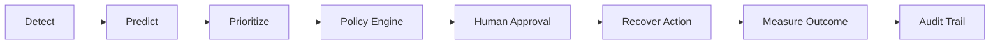

# RecoverIQ — AI Revenue Recovery Agent

An AI-driven revenue recovery and decision engine that predicts recovery probability, prioritizes revenue at risk, recommends policy-compliant recovery actions, and measures outcomes through a human-in-the-loop workflow.

## Problem
Failed payments and involuntary churn result in significant revenue loss for subscription businesses and payment platforms. Current retry logic is often static and rigid, leading to poor customer experiences, high processing costs, and missed recovery opportunities. Additionally, autonomous AI recovery systems pose significant business risks if they operate without human oversight or strict policy guardrails.

## Solution
RecoverIQ is a human-in-the-loop AI Revenue Recovery Agent that intelligently analyzes failed payments, predicts the likelihood of successful recovery, and recommends an appropriate recovery action. Instead of taking blind, autonomous actions, RecoverIQ uses a rule-based policy engine and a transparent approval workflow to ensure all AI decisions are safe, auditable, and aligned with business risk parameters.

## Razorpay AI Buildathon 2026 — Track 03 Alignment
This project aligns directly with **Track 03** of the Razorpay AI Buildathon, focusing on building AI agents that drive concrete business value in the payments ecosystem. By augmenting the revenue recovery process with machine learning predictability and strict policy guardrails, RecoverIQ demonstrates how AI can solve complex financial workflows reliably.

## Core Workflow


## AI / Machine Learning
The intelligence layer of RecoverIQ predicts the probability of successfully recovering a failed payment.

- **Dataset**: A high-quality **synthetic dataset** specifically generated for this project to mirror realistic failed payment patterns.
- **Volume**: 20,000 rows
- **Features**: 18 features (e.g., transaction amount, failure reason, payment method, customer risk score)
- **Target Variable**: `recovered` (Binary: Will this payment be recovered?)
- **Model**: Logistic Regression
- **Preprocessing**: `StandardScaler` (numerical) + `OneHotEncoder` (categorical)
- **Artifacts**: 
  - Model: `backend/ai/model/recovery_model.joblib`
  - Metadata: `backend/ai/model/model_metadata.json`

### Evaluation Metrics
| Metric | Validation Set | Test Set |
| --- | --- | --- |
| **ROC-AUC** | 0.8708 | 0.8592 |
| **PR-AUC** | 0.8299 | 0.8211 |
| **Accuracy** | 0.7943 | 0.7843 |
| **Precision** | 0.7801 | 0.7719 |
| **Recall** | 0.7315 | 0.7131 |
| **F1 Score** | 0.7551 | 0.7413 |
| **Brier Score** | 0.1436 | 0.1507 |

## Decision Engine
The Decision Engine maps the ML probability score and contextual data to a recommended action. Supported actions include:
- **RETRY**: Recommended for technical or temporary failures with high recovery probability.
- **REMINDER**: Recommended to notify customers of upcoming retries or necessary actions.
- **PAYMENT_METHOD_UPDATE**: Recommended when the underlying payment instrument fails repeatedly.
- **NO_ACTION**: Recommended when the recovery probability is extremely low or blocked by policy.

## Policy Guardrails
To prevent risky AI behaviors, the platform enforces strict safety rules before any action is proposed. Our primary implemented safeguard is the **maximum retry limit**, which guarantees the AI cannot spam customers or repeatedly incur processing fees on persistently failing transactions.

## Recovery Workflow
RecoverIQ utilizes a "Human-in-the-Loop" architecture. AI generates **Recovery Actions**, which are flagged as either `PENDING_APPROVAL` or automatically blocked by policy guardrails. Operators can review the AI's explanation and either **Approve** or **Reject** the action. 

## Portfolio Prioritization
Not all failed payments are equal. RecoverIQ assigns a **Priority Score** (combining the transaction value and the ML recovery probability) so operators can focus their time on the highest-yield interventions first.

## Batch Recovery Simulation
Run a synthetic batch simulation across eligible recovery opportunities and measure recorded recovery outcomes against the AI predictions. This provides a holistic view of portfolio performance based on the current model's predictions, generating synthetic outcomes for the demo.

## Explainability
Every AI analysis includes explainability factors describing positive and negative contributors to the prediction. This builds trust with operators and ensures the system remains transparent.

## Recovery Analytics
Real-time dashboarding provides visibility into:
- Active revenue at risk
- Expected recovery based on live AI predictions
- Recorded recovered revenue
- Recovery performance and prediction correctness
- Calibration and Brier score where sufficient outcome data exists

## Expected Recovery vs Actual Recovery
RecoverIQ keeps AI forecasts separate from recorded outcomes.
- Expected Recovery is calculated from the active amount at risk multiplied by the live AI recovery probability.
- Actual Recovered Revenue is recorded only when a recovery workflow produces a synthetic outcome.
- AI predictions are never presented as guaranteed recovered revenue.

## Audit Trail
Audit log records recovery workflow events. From the moment a failure is detected, to the AI prediction, policy evaluation, human approval, and final outcome—everything is tracked for compliance and debugging.

## System Architecture
- **Frontend**: Single Page Application (SPA) providing the operator dashboard and approval interface.
- **Backend**: RESTful API serving the data layer, orchestrating the AI models, and enforcing business logic.
- **Database**: Relational data model for transactions, opportunities, actions, and audit logs.
- **AI Core**: Scikit-learn recovery model with preprocessing and decision engine integration.

## Database
- **PostgreSQL**: The robust, production-ready relational database handling all persistent state.
- **SQLAlchemy 2.x**: ORM for type-safe database interactions.

## API Overview
The backend is built with FastAPI and exposes the following verified endpoints:

**System**
- `GET /health`

**Dashboard & Analytics**
- `GET /api/dashboard/summary`
- `GET /api/analytics/recovery-opportunities`
- `GET /api/analytics/recovery-performance`

**Transactions & Opportunities**
- `GET /api/transactions`
- `GET /api/transactions/{transaction_id}`
- `GET /api/opportunities`
- `GET /api/opportunities/{opportunity_id}`

**Recovery Workflow**
- `GET /api/recovery/actions`
- `POST /api/recovery/batch-simulate`
- `POST /api/recovery/analyze/{opportunity_id}`
- `POST /api/recovery/actions/{opportunity_id}`
- `POST /api/recovery/actions/{action_id}/approve`
- `POST /api/recovery/actions/{action_id}/reject`
- `POST /api/recovery/actions/{action_id}/outcome`

**Customers & Audit**
- `GET /api/customers`
- `GET /api/audit`

## Frontend Technology
- **React**: Component-based UI.
- **Vite**: Next-generation, blazing-fast frontend tooling.
- **Tailwind CSS**: Utility-first styling framework for rapid, responsive design.
- **Recharts**: For dynamic analytics charts.

## Testing
The application features a comprehensive automated test suite ensuring business logic and AI integrations function correctly. 
- **Current Status**: 62 tests passed successfully in the latest backend test run.

## Synthetic Data & Safety Disclaimer
> **IMPORTANT: No real payments are processed, and no real customer data is used.**
> All payment outcomes, transactions, and customer records in this demo are **100% synthetic**. RecoverIQ was designed strictly as a proof-of-concept for the Razorpay AI Buildathon to demonstrate complex AI decisioning architectures. The AI does not communicate with live banking or payment gateway APIs. 

## Demo Flow
1. **Dashboard**: View high-level metrics of revenue at risk.
2. **Opportunities**: Sort failed payments by the AI-generated "Priority Score".
3. **Analyze**: Click into a specific failure to see the AI's explanation and recommended action.
4. **Approve/Reject**: Act as the Human-in-the-Loop to approve the AI's strategy.
5. **Batch Simulation**: Run a synthetic batch simulation to record demo outcomes and compare them with AI predictions.
6. **Audit Trail**: Review the log of the decisions you just made.

## Future Scope
The following features are **not** part of the current implementation but are planned for future iterations:
- Integration with live payment gateways (e.g., Razorpay API) for actual execution.
- Advanced NLP to draft personalized recovery email/SMS outreach.
- Reinforcement Learning to continuously update the model based on real-world outcome feedback.
- Multi-agent negotiation for intelligent payment plans.

## Local Setup

### Backend Setup
```bash
cd backend
python -m venv venv
source venv/bin/activate  # On Windows: venv\Scripts\activate
pip install -r requirements.txt
# Ensure your local PostgreSQL database is configured via the .env file
uvicorn app.main:app --reload
```

### Frontend Setup
```bash
cd frontend
npm install
npm run dev
```
Navigate to `http://localhost:5173` to view the dashboard.

## Why RecoverIQ is Different
Unlike black-box AI tools, RecoverIQ treats AI as an advisory agent bounded by strict business logic, ensuring companies can safely deploy machine learning into sensitive financial workflows without losing control.

---
**RecoverIQ: Bridging the gap between predictive intelligence and safe, auditable financial operations.**
